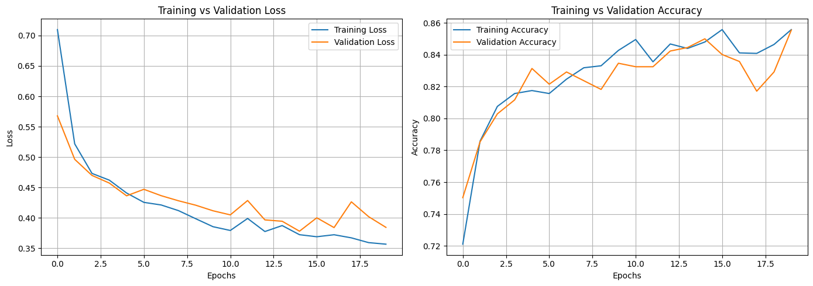
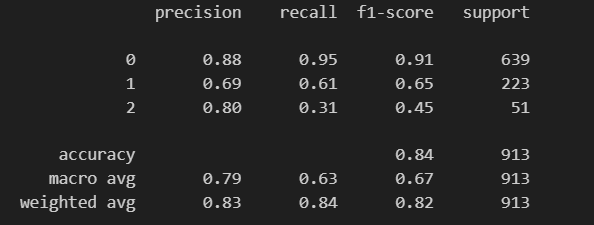
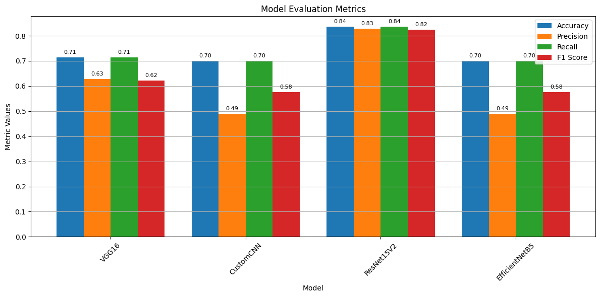

# IBM_Datathon2023
## Severity Grading of Knee Osteoarthritis
  Leveraging the new technologies such as Machine Learning and Deep learning to work on data based problems will contribute to efficient solutions. Here, we use neural networks to train a dataset of knee x-ray images. With the trained neural network model, we will be able to predict the presence of Knee Osteoarthritis using the x-ray scan images of knee. We will also be able to predict the severity of the degeneration using various parameters. The model will learn from a set of 10,000 images and this is called unsupervised learning. Usage of neural networks such as efficient net gives a higher accuracy rate.

## Problem
  Osteoarthritis (OA) is a chronic degenerative joint disease that affects millions of people worldwide. It is the most prevalent kind of arthritis. 
  
  It affects 7% of the global population, or over 500 million people worldwide.
  
  In India, 23.46 million in 1990 to 62.35 million in 2019.
  
  Osteoarthritis cases worldwide have grown by an estimated 132.2% since 1990
  
  Annual incidence of knee OA is highest between 55 and 64 years old.
  
  Moreover, it causes difficult mobility, worsens in pain & Affects quality of life where there is no definite cure, Only treatments to subdue
  
  Deep learning models can provide objective and consistent assessments of osteoarthritis severity, reducing the reliance on subjective evaluations by healthcare professionals. 

## Solution
  The problem at hand is to develop a deep learning model for the automated grading of osteoarthritis severity based on medical imaging, such as X-rays or MRI scans. This severity grading is consistent with clinical assessments and can provide additional insights.
  
  Develop a deep learning model capable of automatically grading the severity of osteoarthritis from medical images.
  
  Achieve a high level of accuracy and consistency in severity grading, in line with clinical assessments.
  
  Enhance the model's interpretability to enable medical professionals to understand and trust its predictions.
  
  Create a scalable solution that can be integrated into clinical practice, telemedicine, or large-scale research studies.

## Results

  We have created multiple models with differentt architecture like VGG16, Custom CNN, ResNet, EfficientNet. the ResNet gave a better accuracy rate of 85% and validation accuracy of 84% compared to others.

### Accuracy and Loss Graph

### Classification Report

### Model Performance Benchmark

## Future implementation

  Developing deep learning models that can grade the severity of osteoarthritis from multiple imaging modalities, such as X-rays, MRIs, and CT scans.
  
  Developing deep learning models that can be used to predict the progression of osteoarthritis over time.
  
  Using deep learning to develop personalized treatment plans for patients with osteoarthritis.
  
  Using deep learning to identify biomarkers of osteoarthritis severity and progression.
  
  Using deep learning to develop new diagnostic and therapeutic tools for osteoarthritis.

## Conclusion 

  ResNet or Residual neural network produced better accuracy of 0.84 than CNN with an accuracy of 0.70 and Efficient Net model which produced an accuracy of 0.70. ResNet overcomes the "vanishing gradient" problem, making it possible to construct networks with up to thousands of convolutional layers. These networks outperform shallower networks. In conclusion, the implementation of severity grading of osteoarthritis using deep learning represents a significant advancement in healthcare and medical research.

